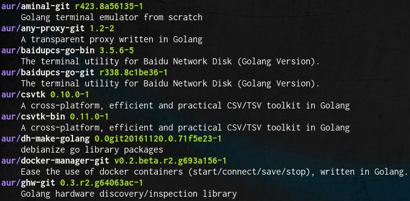

# Aurgasm
A simple ArchLinux AUR build tool leaded by two main guidelines :
* Mimics pacman (same options syntax, same configuration `/etc/pacman.conf` file)
* KISS philosophy



## Supported options
### Search for packages
```bash
aurgasm -Ss {keyword}
```
### Install a package
```bash
aurgasm -S {thepackage}
```

## Supported pacman configuration
Aurgasm support some of the `/etc/pacman.conf` options :
* Color
